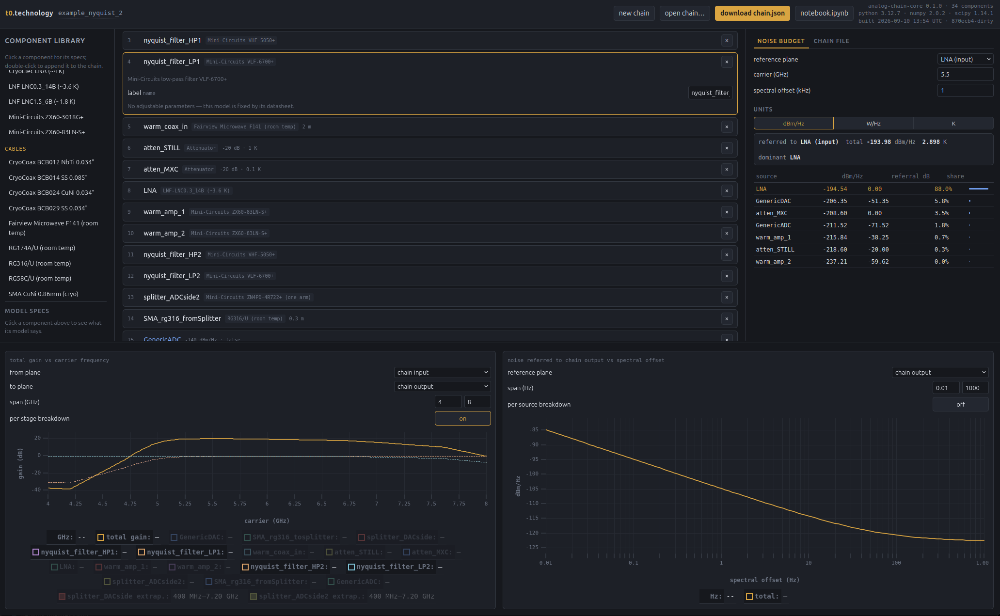
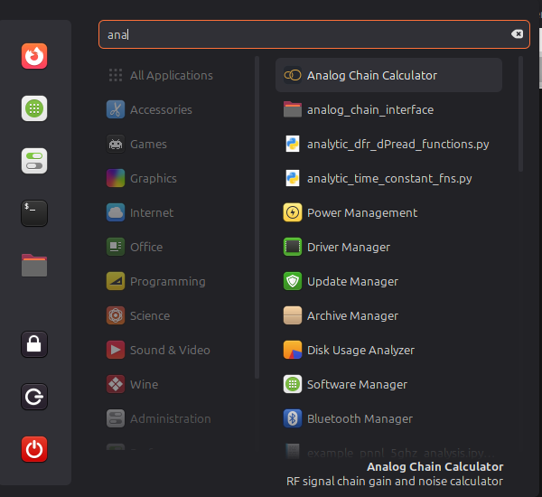

# RF Analog Chain Calculator

Build an RF signal chain, inspect its gain across a frequency band, and identify which components dominate its noise budget. The project combines a browser editor with a Python analysis core for room-temperature and cryogenic systems, including chains between a DAC and an ADC.

The browser runs the same Python models as scripts and notebooks through Pyodide. Chains are saved as JSON so a design can move between the interactive editor, a Jupyter notebook, and measurement analysis.

This project is based on the analog chain hardware models in `hidfmux`. For the original work and background, see [the project author's thesis (McGill University, PDF)](https://mcgill.scholaris.ca/bitstreams/aaa1cb7b-afb7-40b8-89f5-530e4c294c4a/download).



*Example browser session with Nyquist filters, cryogenic attenuation, amplifiers, and converters. The lower panels show gain versus carrier frequency and noise versus spectral offset.*

## What it does

- **Edit chains visually:** inspect component specifications, add and reorder stages, change parameters, and assign labels to reference points.
- **Analyze gain:** sweep carrier frequency between selected input/output planes, with optional per-stage curves.
- **Build noise budgets:** refer every source to a selected plane, rank contributions, and display density in dBm/Hz or W/Hz, or equivalent noise temperature in K.
- **Inspect noise spectra:** sweep offset from the carrier and optionally show each source separately.
- **Save the design and its context:** JSON files carry component parameters, labels, notes, metadata, and an optional saved operating point.
- **Continue in Jupyter:** export a notebook containing the current chain, plots, budget and CSV export, plus a parameter comparison when an editable component is available.
- **Generate diagrams from Python:** use the matplotlib diagram generator for annotated chain drawings.

## Quick start

Set up an environment, install the menu entry once, then launch **Analog Chain Calculator** from your start menu. From the repository root, choose one of the environment options below. The project requires Python 3.9 or newer; the uv and Miniconda examples select Python 3.12. The commands use a Unix-style shell. **Windows has not been tested**; it may work, but these instructions do not establish Windows support.

### Option 1: Python venv

```bash
python -m venv .venv
source .venv/bin/activate
python -m pip install --upgrade pip
```

### Option 2: uv

With [uv](https://docs.astral.sh/uv/pip/environments/) installed:

```bash
uv venv --python 3.12 --seed
source .venv/bin/activate
```

`--seed` includes `pip`, which the launcher invokes to build the core wheel. Keep it even if you use `uv pip` for other package installs.

### Option 3: Miniconda

With Miniconda installed and `conda` initialized in your shell, create a dedicated [Conda environment](https://docs.conda.io/projects/conda/en/latest/user-guide/tasks/manage-environments.html):

```bash
conda create -n analog-chain python=3.12 pip
conda activate analog-chain
```

### Install once, launch from the start menu

With your chosen environment active, run this once from the repository root on Linux:

```bash
python open_web_gui.py --desktop
```

**Then open your applications/start menu, search for “Analog Chain Calculator”, and click it.** Use that menu entry whenever you want to open the calculator; there is no need to return to the terminal.



*Search for Analog Chain Calculator in the start menu and click the highlighted application.*

The menu launcher builds or updates the browser calculator when needed and opens it in your browser. **Network access is required on first launch** to download the Python runtime and dependencies. Subsequent loads may use the browser cache; a fully offline bundle is not implemented.

Having opened the page, the launcher keeps running in the background as the save helper: it is what puts a real save dialog up when you save a chain file, opened on the folder you last saved that kind of file to. Closing it (or launching with `--no-helper`) costs only that — the buttons fall back to downloading into your browser's download folder. See [where saved files go](web/README.md#where-saved-files-go).

### Updating

```bash
git pull
```

That is the whole procedure. The next start-menu launch compares the checkout against what the calculator was last built from and rebuilds the parts that changed — a few seconds — before opening the page; you do not need to re-run `--desktop` or rebuild by hand. If a rebuild cannot finish, the launcher says so in a dialog and writes what the build printed to `dist/last-build.log`.

See [the browser guide](web/README.md) for build details.

## Using the browser

1. Start with the initial preset, choose **new chain**, or use **open chain…** to load a JSON file from [examples](examples/).
2. Click a library component to inspect its model; double-click to add it. Edit stage parameters and labels, and reorder stages to match the signal path. DAC and ADC models occupy the endpoints.
3. Set the noise budget's reference plane, carrier frequency, and spectral offset. Select units and inspect each source's share of the total.
4. Adjust the gain plot's planes and frequency span, and the noise plot's reference plane and offset span. Enable component/source breakdowns as needed.
5. Click the chain name to edit its name and notes. **save the current view** records the operating point for reopening the chain; changing plot controls alone does not save it.
6. Use **save chain.json** to save the chain or **notebook.ipynb** to continue the analysis in Jupyter — both ask where to put the file and open on the folder you last used for that kind of file. The **Chain file** tab previews the serialized record.

## Continue in a notebook

Click **notebook.ipynb** in the browser to download a Jupyter notebook for your current chain and analysis settings. It includes:

- Gain and noise plots, including noise referred to your selected plane.
- A per-source noise budget and CSV export.
- An example of changing a component parameter and comparing the results, when applicable.

The chain is embedded in the notebook, alongside the code and instructions to continue the analysis. Open it in Jupyter and follow its setup instructions; you will need a local checkout or installation of the core and matplotlib for plotting.

For a guided example, see the [notebook walkthrough](examples/analog_chain_walkthrough.ipynb). Saved chains to try in the browser are in [examples](examples/).

## Interpreting results

| Quantity | Meaning |
|---|---|
| Carrier frequency | RF frequency of the signal; determines component gain and RF-dependent noise levels. Python inputs use Hz. |
| Spectral frequency | Offset from the carrier where noise is evaluated; also in Hz. This captures structure such as a DAC's phase-noise skirt. |
| Gain | Power gain in dB; attenuation is negative. |
| Noise density | Power spectral density in W/Hz or dBm/Hz. Equivalent K is PSD divided by Boltzmann's constant, not necessarily a physical temperature. |
| Reference plane | Input or output of a named stage. The side is explicit because a stage's gain changes the referred value. |

A plane-referred budget includes **all sources**, including downstream sources referred backward through intervening gain. It describes the noise limiting the system at that reference plane; it is not simply the noise a meter would measure there.

The models describe a linear cascade. They do not solve impedance mismatch, reflections, compression, or a multiport network. The splitter represents loss through one arm; the circulator represents insertion loss only. Cables and filters currently contribute loss without added thermal noise; the attenuator explicitly supplies a `k_B T` noise term. These are model choices to account for when comparing a budget with hardware.

Datasheet-based gain models can extrapolate beyond their tabulated span with a ceiling on gain. The plots flag extrapolation for models that opt into it; cables intentionally do not show these flags. Amplifier noise curves are not extrapolated, so out-of-range analysis can produce unavailable values. Consult the component specifications and [model references](component_references/README.md) before relying on a result outside its supported band.

The AD9082 ADC uses an SNR-derived noise floor; `GenericADC` defaults to a stated −140 dBm/Hz density. They are different assumptions. Browser and local results also depend on their NumPy/SciPy versions, particularly the fitted AD9082 DAC model; the browser exposes build/runtime provenance.

## Chain files and reproducibility

The current JSON format is version 2. It stores stable registry type IDs, constructor parameters, labels, converter endpoints, name, description, free-form `metadata`, and a save timestamp. Earlier supported formats and class-name aliases can still load.

Always inspect `chain.load_warnings`: loading may substitute defaults or skip entries that cannot be reconstructed. A successful load alone does not guarantee every saved component was restored. JSON files describe models and parameters, not a frozen numerical environment; retain the code and dependency versions when exact reproducibility matters.

The reserved `metadata.analysis` key stores the preferred carrier, spectral offset, plot spans and reference planes. It affects the starting view and notebook export, not the physics. Use `chain_api.set_analysis(...)` to validate and save it, and `chain_api.analysis()` to inspect resolved or ignored fields. `set_metadata(...)` replaces the entire metadata mapping, including this key.

## Codebase map

| Path | Responsibility |
|---|---|
| `component.py` | Base component classes, gain/noise contract, and noise reference conventions. |
| `hardware_models.py` | Amplifiers, cables, attenuators, filters, converters, splitter, and circulator models. |
| `registry.py` | Stable model IDs, parameter schemas and validation, aliases, and retired parameters. |
| `signal_chain.py` | Ordered stages, reference planes, cascade calculations, and JSON persistence. |
| `noise_budget.py`, `utils.py` | Budget records, tables, unit conversions, and numerical helpers. |
| `chain_api.py` | Stateful JSON-facing API for editing, analysis, presets, and provenance. |
| `notebook_export.py` | Generates executable notebooks for the active chain and view. |
| `web/`, `tools/assemble_web.py`, `open_web_gui.py` | Browser UI, single-file assembly, and launcher. |
| `diagram_generator.py` | Matplotlib chain diagrams. |
| `component_references/` | Source datasheets and notes on model scope. |
| `tests/` | Physics, characterization, serialization, API, diagram, and notebook tests. |
| `analog_chain.py`, `analog_chains/`, `gui_components/`, `transferfunctions/` | Earlier application and deployment-specific code; outside the packaged core. Some legacy modules require `hidfmux`. |

## Development

To add a model, subclass the appropriate class in `component.py`, implement `gain(carrier_frequency)` and any nonzero `noise(carrier_frequency, spectral_frequency)`, and register it with `@register(...)` and `ParamSpec` definitions. Record constructor parameters through the base class so serialization can reconstruct them. The registry drives browser forms as well as validation; rebuild the browser wheel and page after changing a model.

Run the existing test suite from the checkout:

```bash
python -m pip install -e .
python -m pip install pytest matplotlib
python -m pytest tests/ -q
```

Characterization tests compare model output with [golden component data](tests/data/golden_components.json). After an intentional numerical change, regenerate the baseline and review its diff:

```bash
python tests/test_characterization.py --regenerate
```

## License

[MIT](LICENSE).
